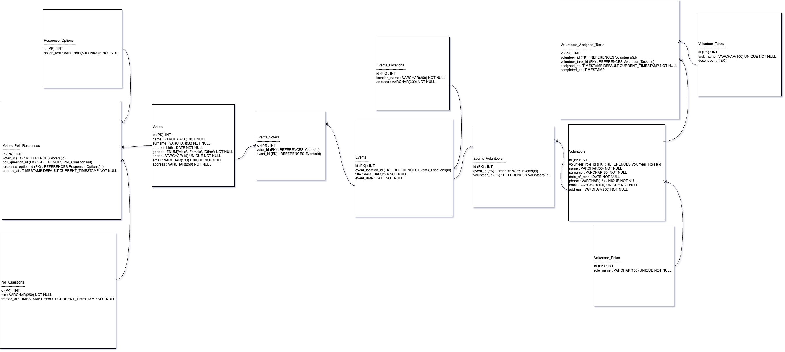

# Political Campaign Database Model

This project contains a logical 3NF data model designed for managing a political campaign. It was created based on a predefined topic and task specification.

## Project features

- 10+ tables, normalized to **Third Normal Form (3NF)**
- Includes a **many-to-many relationship**
- Clearly specified **primary and foreign keys**
- Constraints like `NOT NULL`, `UNIQUE`, and proper **data types**
- Diagram with visualized relationships and correct cardinalities
- Field and table names follow clear naming conventions

## Files

-  – ER diagram
- `DB_Bermet_Usubalieva_HW_PoliticalCampaign_descriptions.docx` – detailed table/field descriptions

> Created as part of an educational database modeling assignment (EPAM training)

## Skills demonstrated

- Data modeling and normalization (3NF)
- Identifying many-to-many relationships
- Implementing constraints and choosing data types
- Designing scalable relational schemas
